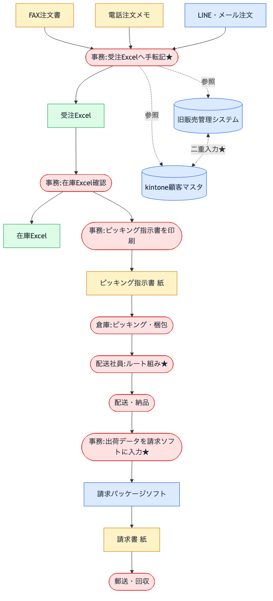

# 業務フロー図｜株式会社マルキ食品（現状）

> ヒアリング内容をもとに、現状の主軸業務（受注 → 在庫 → 出荷 → 請求）を1枚に整理したものです。各工程で使われている媒体・システムと、属人化・手作業のポイントを明示しています。

## 凡例

- 角丸：作業（人の手が入る工程）
- 四角：システム・媒体
- 点線：参照のみ
- ★：手作業・属人化が集中する点

## 主軸フロー

> **図のソース：** `assets/01-business-flow.mmd`（Mermaid 形式）
> **再生成コマンド：** `npx --yes -p @mermaid-js/mermaid-cli mmdc -i assets/01-business-flow.mmd -o assets/01-business-flow.png -b transparent -w 1600`

## 図から読み取れる構造

- 受注の入口は3チャネルあるが、すべて事務担当の手転記に集約される（**B1 が単一障害点**）
- 在庫情報は Excel で、夜間バッチ的に手動更新されており、日中はリアルタイム性がない
- ピッキング指示書は紙のままで、倉庫から事務へのフィードバックループが切れている
- 配送ルート組みは E2 の頭の中にある（**ナレッジが文書化されていない**）
- 請求工程で再度の手入力が発生（F1）：受注Excelから請求ソフトへの転記
- 顧客マスタは旧システムと kintone が**双方向に二重入力**されており、不整合が常態化

## 手作業・属人化が集中する4点（★）

1. **B1：注文の手転記** — 月3〜5件のクレーム原因
2. **E2：配送ルート組み** — 退職リスクと直結
3. **F1：請求への再入力** — 同じデータを2回触っている
4. **G1↔G2：顧客マスタ二重入力** — 統合方針なし

これら4点が、後続の「課題整理」と「改善案」での主な検討対象になります。
